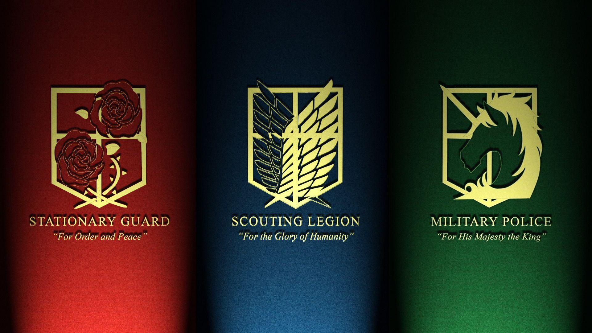
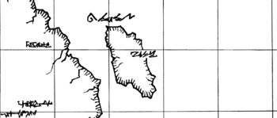
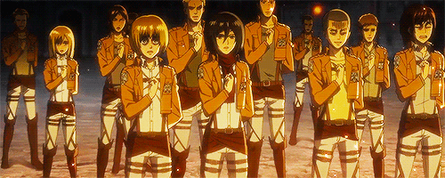
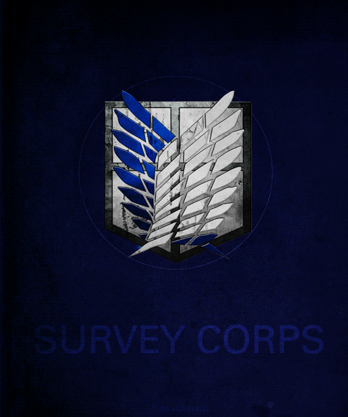
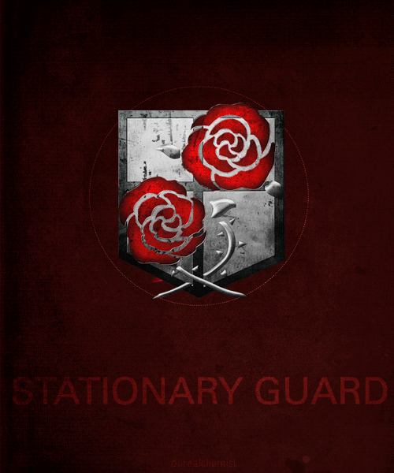
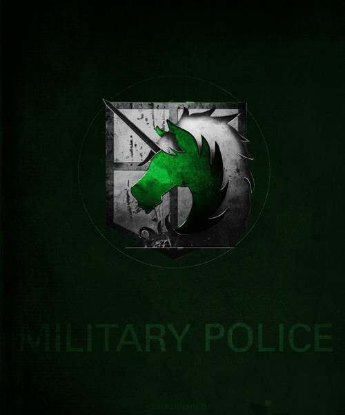
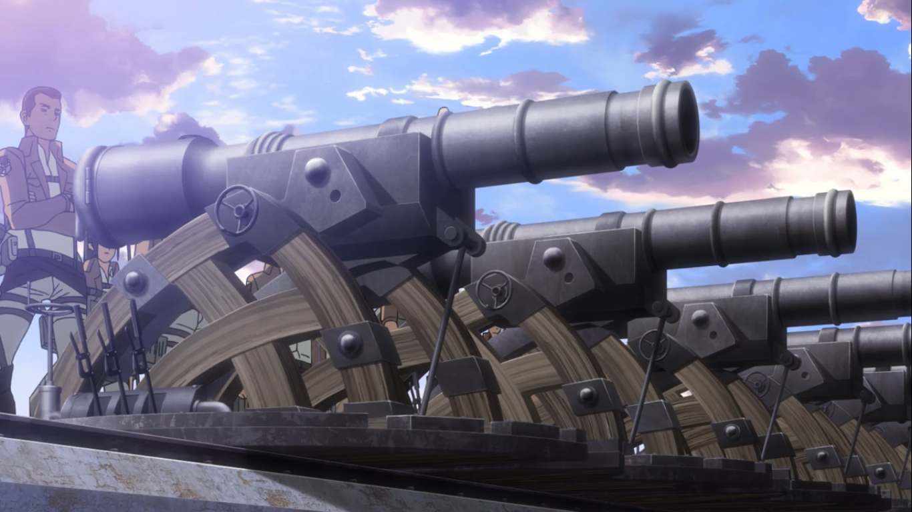

<!DOCTYPE html>
<html>
<head>
 <title>Eldian Paradis Military</title>
 <link rel="stylesheet" type="text/css" href="style.css">
</head>
<body>

 
  

    <a href="#" class="logo">ELDIA(paradis island</a>
    <audio src="SNK.mp3" "autoplay controls"></audio>
    <a href="#" class="login">Login</a>
  

  

    
    <input class="slide" type="radio" name="slider-1" id="s-1-1" /><label for="s-1-1"></label>
    

      
      

        <h3>The military (軍事 Gunji)</h3>
        
 juga dikenal sebagai the Armed Forces of Eldia adalah angkatan bersenjata handal yang siap siaga dari Eldia di Pulau Paradis yang awalnya dilatih untuk menangani para Titan di dalam dan di luar Tembok. Ini dibagi menjadi tiga cabang

        <a href="#more1" class="button button-blue">more</a>
      

    

    <input class="slide" type="radio" name="slider-1" id="s-1-2" /><label for="s-1-2"></label>
    

      
      

        <h3>Paradis Island</h3>
        
 adalah pulau besar tempat ketiga Tembok berada, dan wilayah terakhir Eldia.

        <a href="#" class="button button-orange">Alamat</a>
      

    

    <input class="slide" type="radio" name="slider-1" id="s-1-3" checked /><label for="s-1-3"></label>
    

      
      

        <h3>Uniform and equipment</h3>
        
Semua anggota militer, kecuali Training Corps instructors, mengenakan seragam serupa yang terdiri dari jaket pendek berwarna coklat muda dengan lencana regu di kedua bahu, di saku kiri depan dan di tengah belakang, berwarna terang. kemeja, ikat pinggang cokelat tua di sekitar pinggang yang menutupi pinggul, celana putih, dan sepatu bot kulit setinggi lutut berwarna cokelat tua.

        <a href="#more2" class="button button">more</a>
      

    

    
  

  

    <a href="#more1">About</a><a href="#kontak">Kontak</a><a href="#daftar">daftar</a>
	

  

  

    
    <h4 class="caption">The Scouting Legion</h4>
    
Tugas dari pasukan pengintai adalah pengembangan manusia dan juga penelitian Titan , pasukan pengintai di komandani oleh Erwin Smith ,  Sebelum dinding Maria ditembus oleh Titan  , para pasukan pengintai mengeksplorasi lahan di luar Tembok , walaupun tidak pernah membawa hasil , tetapi hanya membawa korban jiwa yang diakibatkan oleh Titan.itu karena survey corps merupakan militer yang paling aktif terlibat dalam pertempuran melawan Titan

  

  

    
    <h4 class="caption">The Stationary Troops</h4>
    
Tugas dari The Stationary Troops adalah menjaga dan memelihara tembok dan dikomandani oleh Dot Pixis , pasukan penjaga juga mengurus semua pertahanan . Pasukan penjaga memasang meriam didinding untuk mempertahankan tembok dari Titan . Para pasukan penjaga harus evakuasi warga sipil , lalu juga harus memiliki rencana cadangan untuk menangani situasi ketika tembok di tembus . Para pasukan penjaga mahir melalui bebagai tugas seperti bertempur dengan para Titan , pengendalian massa dan penggunaan senapan

	

  

  

    
    <h4 class="caption">The Military Police</h4>
    
Divisi Militer ini adalah pasukan yang paling bergengsi , karena tugas mereka memungkinkan untuk hidup aman didalam dinding dengan sumber daya yang melimpah , serta otoritas yang lebih tinggi dari pasukan militer lainnya .Namun nyatanya , sektor militer ini juga kurang pengasawan dibandingkan denga sektor lain dari militer , karena penyalahgunaan wewenang , Brikade Plosi Militer juga bertentangan dengan pasukan Penjaga dan juga pasukan Pengintai .Pasukan ini dikomandani oleh Nile Dawk dan tugas dari pasukan brikade ini adalah bukan hanya menjaga ketertiban , namun juga melayani sebai penjaga raja . Mereka juga tergolong dalam kepolisian dalam wilayah manusia .

  

  

    
    <input class="slide" type="radio" name="slider-2" id="s-2-1" /><label for="s-2-1"></label>
    

      
      

        <h3>The vertical maneuvering equipment</h3>
        

		Beberapa alat yang ada dalam 3d maneuver gear antara lain: 
         Handgrips 
         Piston-shot grapple-hooks 
         Gas powered mechanism 
         Iron Wire Propeller with Plug in Blades 
        

        <small>
		  The vertical maneuvering equipment (立体機動装置 Rittai kidō sōchi?)/3-D meneuver gear adalah satu set gear dalam seri Attack on Titan,
dikembangkan oleh manusia yang memungkinkan mobilitas besar saat menghadapi para Titan. gearnya sendiri membutuhkan
bentuk body harness yang menutupi sebagian besar tubuh di bawah leher.
meskipun dapat digunakan tapi, membutuhkan skill yang bagus,
gear beresiko besar membebani otot pengguna,
oleh karena itu diperlukan kondisi fisik yang khusus untuk menggunakan gear ini.
        </small>
      

    

    <input class="slide" type="radio" name="slider-2" id="s-2-2" checked /><label for="s-2-2"></label>
    

      
      

        <h3>Wall-mounted artillery</h3>
        

         Wall-mounted artillery (壁上固定砲 Kabe jō kotei hō) Adalah senjata pertama(utama) yang digunakan untuk melawan para Titan sebelum pengembangan vertical maneuvering equipment .
Meskipun memiliki kemampuan untuk meledakkan kepala Titan dalam satu tembakan, 
setengah dari semua Titan akan meregenerasi kepala mereka;
 satu-satunya cara pasti untuk membunuh Titan adalah dengan menghancurkan tengkuknya. 
 Selain itu, waktu yang dibutuhkan untuk memuat ulang dan mengarahkan meriam membuatnya tidak dapat digunakan untuk strategi ofensif melawan Titans.
 Namun, meriam masih digunakan dalam posisi pertahanan statis,
 terutama di atas Tembok dan dekat gerbang jika terjadi pelanggaran. 
 Karena itu, mereka paling sering digunakan oleh Garnison/The Stationary Troops, yang berpatroli di daerah tersebut.
        

        <small>
        </small>
      

    

    
  

  

  

    offer you live!!
     
    <a href="#" class="button button-green">daftar the military</a>
  

  

    

      <a href="#">Mulai</a>
      <a href="#">Profil </a>
      <a href="#">Blog</a>
    

    

      <a href="#">About</a>
      <a href="#kontak">Kontak</a>
      <a href="#">Alamat</a>
      <a href="#">Review</a>
    

    

	

      <a href="https://www.instagram.com/anhar_220801/">Instagram</a>
      <a href="https://web.facebook.com/muhammad.anhar.22/">Facebook</a>
      <a href="012345678901">WhatsApp</a>
    

    <form class="column subscribe" action="javascript:void(0)">
      <h4 class="caption">follow for updates</h4>
      
SHINZOU WO SASAGEYO!!!!!!

    </form>
  

  

    Scouting Legion
    <a href="#">Terms of Use</a>
    <a href="#">EULA</a>
    <a href="#">Privacy Policy</a>
    

      
      
      
    

  

</body>
</html>

html, body {margin:0; padding:0;}
#landing, #landing *, #landing :before, #landing :after {
  position:relative;
  margin:0;
  padding:0;
  box-sizing:border-box;
  vertical-align:middle;
  text-overflow:ellipsis;
  font-family:Montserrat, Arial, Helvetica, Tahoma, Verdana, sans-serif;
}
#landing {
  width:1500px;
  font-size:16px;
  padding-top:4.0625em;
  background:#C0C0C0;
  text-align:center;
}
#landing {font-size:1.061vw; width:auto;}
#landing > * {text-align:left;}
#landing .button {
  display:inline-block;
  padding:.75em 1.4em;
  border-radius:2em;
  font-weight:bold;
  line-height:normal;
  text-align:center;
  text-decoration:none;
  text-transform:uppercase;
  background-color:#99ce45;
  border:.125em solid #99ce45;
  color:#fff;
  transition:background .4s, color .4s, border-color .4s;
}
#landing .button:hover {background:transparent; color:#99ce45;}
#landing .button:active {opacity:.5;}
#landing .button-blue {background:#01b0fe; border-color:#01b0fe;}
#landing .button-blue:hover {background:transparent; color:#01b0fe;}
#landing .button-orange {background:#fe8f4f; border-color:#fe8f4f;}
#landing .button-orange:hover {background:transparent; color:#fe8f4f;}
#landing > .header {
  position:fixed;
  left:0;
  right:0;
  top:0;
  height:4.0625em;
  z-index:100;
  background:rgba(255,255,255,.9);
  padding:.9em 1.25em;
  line-height:2em;
  text-align:right;
  border-bottom:1px solid rgba(0,0,0,.1);
  word-spacing:2.5em;
}
#landing > .header > * {display:inline-block; word-spacing:normal;}
#landing > .header > .logo {
  display:inline-block;
  position:absolute;
  left:2em;
  width:12.66%;
  max-width:11.8em;
  letter-spacing:.em;
  white-space:nowrap;
  color:#e12120;
  overflow:hidden;
  background:url("eldian.png") no-repeat center left;
  background-size:contain;
}
#landing > .header > .button {font-size:.75em; border-width:.18em;}
#landing > .header > .login {
  font-size:.875em;
  color:#03b4fe;
  font-weight:bold;
  text-decoration:none;
  text-transform:uppercase;
  transition:all .2s;
  border:0 solid transparent;
}
#landing > .header > .login:before {
  content:"";
  display:inline-block;
  width:1.429em;
  height:1.429em;
  margin:-.2em .5em 0 0;
  background:url("logo.png") no-repeat center center;
  background-size:contain;
}
#landing > .header > .login:hover {
  border:.166em solid #03b4fe;
  border-radius:2em;
  padding:0 1em;
}
#landing > .menu {
  text-align:center;
  background:#808080;
  font-size:1.125em;
  padding:1.278em 0;
}
#landing > .menu > a {
  display:inline-block;
  width:12.5em;
  height:2em;
  line-height:2em;
  border:0 solid #444444;
  border-width:0 2px;
  margin-left:-2px;
  color:#fff;
  text-decoration:none;
  text-transform:uppercase;
  transition:border-color .5s, color .1s;
}
#landing > .menu > a:first-child {border-left:0 none;}
#landing > .menu > a:last-child {border-right:0 none;}
#landing > .menu > a:hover {
  z-index:50;
  text-transform:none;
  font-size:1.335em;
  color:#0a5070;
  width:9.3635em;
  height:1.5em;
  line-height:1.5em;
  border-color:#808080;
}
#landing > .feature {
  display:inline-block;
  width:23.75em;
  margin-top:5.125em;
  padding:0 1.625em;
  text-align:center;
  vertical-align:top;
}
#landing > .feature > .picture {width:11.9375em; max-width:191px; margin-bottom:2.25em;}
#landing > .feature > .caption {
  font-size:1.4em;
  font-weight:normal;
  margin-bottom:.8em;
  min-height:2.43em;
  color:#3e4e5c;
  text-align:left;
}
#landing > .feature > .summary {color:#737d85; font-size:.86em; text-align:left;}
#landing > .extra {display:inline-block; text-align:center; color:#3e4e5c; font-size:2.25em; width:13.333em; margin:1.5em 0 3em;}
#landing > .extra .button {font-size:.65em; padding:.62em 2.612em; text-transform:none; font-weight:normal; margin-top:1.5em;}
#landing > .footer {
  display:table;
  width:100%;
  padding:0 6em;
}
#landing > .footer > * {display:table-cell; vertical-align:top; line-height:2;}
#landing > .footer a {color:#000000; text-decoration:none;}
#landing > .footer a:hover {color:#000000;}
#landing > .footer > .column:nth-child(1) a,
#landing > .footer > .column:nth-child(2) a,
#landing > .footer > .column:nth-child(3) a {display:block; font-size:.875em;}
#landing > .footer > .column:nth-child(1) a {font-size:1.125em;}
#landing > .footer > .subscribe {width:50%; top:-.5em;}
#landing > .footer > .subscribe > .caption {font-size:1.125em; font-weight:normal; color:#000000;}
#landing > .footer > .subscribe > .summary {font-size:.875em; color:#000000; margin-bottom:.5em;}
#landing > .footer > .subscribe > .email {
  width:83%;
  font-size:.875em;
  border:.125em solid #000000;
  border-radius:3px;
  appearance:none;
  line-height:3em;
  padding:0 1em;
}
#landing > .footer > .subscribe > .email + button {
  width:17%;
  font-size:.875em;
  border:0;
  border-radius:3px;
  appearance:none;
  line-height:3em;
  padding:0 1em;
  text-align:center;
  text-transform:uppercase;
  background:#444444;
  color:#fff;
  cursor:pointer;
  margin-left:-.4em;
}
#landing > .copyright {font-size:.875em; border-top:2px solid #eee; margin:2em 6.8em 0; padding:2em 0; color:#8e9ea9; word-spacing:1.5em;}
#landing > .copyright:after {content:""; display:block; height:0; overflow:hidden; float:none; clear:both;}
#landing > .copyright > * {word-spacing:normal;}
#landing > .copyright a {color:#444444; text-decoration:none;}
#landing > .copyright a:hover {color:#3e4e5c;}
#landing > .copyright > .social {float:right; word-spacing:1.5em;}
#landing > .copyright > .social > * {word-spacing:normal;}
#landing > .copyright > .social > .ico:before {font-family:"ico"; font-size:1.8em;}
#landing > .copyright > .social > .fa:before {
  display: inline-block;
  font: normal normal normal 1.8em FontAwesome;
  text-rendering: auto;
  -webkit-font-smoothing: antialiased;
  -moz-osx-font-smoothing: grayscale;
}

#landing .slider {position:relative; overflow:hidden; text-align:center;}
#landing .slider .content {text-shadow:0 0 1px rgba(0,0,0,.2)}
#landing .slider > img.ratio {display:inline-block; position:relative; box-sizing:border-box; width:100%; border:0 none; outline:0 none; margin:0; /* data:image/gif;base64,R0lGODlhAQABAIAAAAAAAP///yH5BAEAAAEALAAAAAABAAEAAAIBTAA7 */}
#landing .slider > input.slide {position:absolute; width:0; height:0; margin:0; padding:0; border:0; opacity:0; overflow:hidden;}
#landing .slider > input.slide + label {display:inline-block; width:3.32em; height:3.125em; margin-top:-3.125em; padding:1.5em .25em 0; top:-.5em; cursor:pointer; z-index:100;}
#landing .slider > input.slide + label:before {content:""; display:block; border:1px solid rgba(255,255,255,.3); transition:border-color .2s;}
#landing .slider > input.slide + label:hover:before {border-color:rgba(255,255,255,.4);}
#landing .slider > input.slide:checked + label:before {border-color:rgba(255,255,255,1);}
#landing .slider > input.slide + label + div,
#landing .slider > input.slide + label + div > img:first-child,
#landing .slider > input.slide + label + div > img:first-child + div {position:absolute; z-index:0; top:0; left:0; right:0; bottom:0; text-align:left; overflow:hidden;}
#landing .slider > input.slide + label + div > img:first-child {width:100%; height:100%; opacity:.9;}
#landing .slider > input.slide + label + div {transition:opacity 1s, transform 1.5s; opacity:0; transform:scale(1.5); background:rgba(0,0,0,.8);}
#landing .slider > input.slide:checked + label + div {z-index:50; opacity:1; transform:scale(1);}
#landing .slider > input.slide + label + div:before {
  content:"";
  display:block;
  position:absolute;
  bottom:1px;
  left:0;
  width:0;
  opacity:0;
  z-index:100;
  background:#444444;
  height:2px;
  transition:width 6.8s linear, opacity 3s 1s linear;
  box-shadow:0 0 2px rgba(0,0,0,.5);
}
#landing .slider > input.slide:checked + label + div:before {width:100%; opacity:1}
